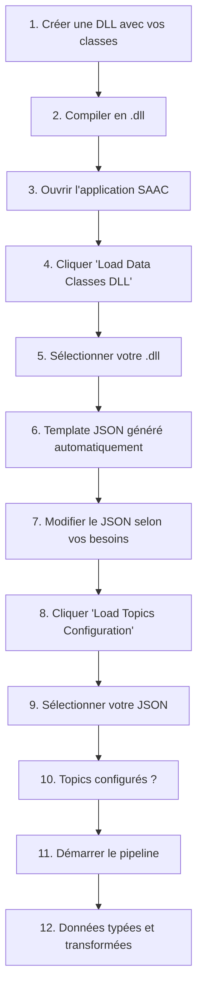

# ?? Documentation - Configuration Loader System

## ?? Par où commencer ?

### ?? Je suis un utilisateur final
? Lisez **`QUICKSTART.md`** (5 minutes max)

### ????? Je suis développeur intégrant cette feature
? Lisez **`CONFIGURATION_LOADER_README.md`** + **`UI_INTEGRATION_GUIDE.md`**

### ?? Je veux comprendre l'architecture
? Lisez **`ARCHITECTURE.md`** + **`IMPLEMENTATION_SUMMARY.md`**

### ?? Je veux tous les détails
? Lisez tout dans cet ordre :
1. `QUICKSTART.md`
2. `CONFIGURATION_LOADER_README.md`
3. `IMPLEMENTATION_SUMMARY.md`
4. `ARCHITECTURE.md`
5. `UI_INTEGRATION_GUIDE.md`

---

## ?? Arborescence des Fichiers

```
ServerApplication/
?
??? Helpers/
?   ??? ConfigurationLoader.cs ............. ?? Classe principale
?   ??? CONFIGURATION_LOADER_README.md .... ?? Guide détaillé
?
??? Examples/
?   ??? config_example.json ............... ?? Exemple config
?   ??? config_schema.json ............... ?? Schéma JSON
?   ??? EXAMPLE_DATA_CLASSES.cs .......... ?? Exemple code
?
??? MainWindow.xaml.cs .................... ??? Interface + méthodes
?
??? Documentation/
    ??? QUICKSTART.md ..................... ?? Démarrage 5 min
    ??? CONFIGURATION_LOADER_README.md ... ?? Guide complet
    ??? IMPLEMENTATION_SUMMARY.md ........ ?? Vue d'ensemble tech
    ??? ARCHITECTURE.md .................. ??? Architecture système
    ??? UI_INTEGRATION_GUIDE.md .......... ?? Intégration UI
    ??? INDEX.md (ce fichier) ........... ?? Navigation
    ??? EXAMPLES/ ......................... ?? Fichiers exemple
        ??? config_example.json
        ??? EXAMPLE_DATA_CLASSES.cs
```

---

## ?? Concepts Clés

### 1. **Configuration Loader**
Système pour charger dynamiquement des DLLs et configurer les topics via JSON.

### 2. **DLL (Dynamic Link Library)**
Fichier compilé contenant vos classes de données personnalisées.

### 3. **Topics**
Identifiants des flux de données dans le pipeline Rendezvous.

### 4. **JSON Configuration**
Fichier structuré mappant topics ? types ? transformers.

### 5. **Type Resolution**
Processus de découverte des types à partir de leurs noms qualifiés.

---

## ?? Cas d'Usage

### Use Case 1 : Démarrer Simple
**Objectif** : Charger des types built-in (int, float, string, etc.)

```json
[
  {
    "topic": "temperature",
    "type": "float",
    "class": "System.Single, System.Private.CoreLib",
    "transformer": null
  }
]
```

### Use Case 2 : Types Personnalisés
**Objectif** : Charger des classes personnalisées depuis une DLL

```json
[
  {
    "topic": "sensor_data",
    "type": "SensorData",
    "class": "MyDataClasses.SensorData, MyDataClasses",
    "transformer": null
  }
]
```

### Use Case 3 : Avec Transformers
**Objectif** : Appliquer du traitement aux données

```json
[
  {
    "topic": "raw_audio",
    "type": "AudioFrame",
    "class": "MyDataClasses.AudioFrame, MyDataClasses",
    "transformer": "MyDataClasses.AudioProcessor, MyDataClasses"
  }
]
```

---

## ?? Flux Typique d'Utilisation



---

## ?? Dépannage Rapide

| Symptôme | Cause | Solution |
|----------|-------|----------|
| "Type introuvable" | Type n'existe pas | Vérifier le nom qualifié |
| "DLL non trouvée" | Mauvais chemin | Utiliser le dialogue de fichier |
| "JSON invalide" | Format incorrect | Valider avec config_schema.json |
| "Veuillez charger DLL" | JSON avant DLL | Charger la DLL d'abord |

---

## ?? Tips Utiles

1. **Générez toujours le template** - Ne créez pas le JSON manuellement
2. **Copiez-collez les noms complets** - Utilisez le format exact
3. **Testez un type à la fois** - Ajoutez progressivement
4. **Consultez les logs** - Ils disent exactement ce qui s'est passé
5. **Validez votre JSON** - Utilisez config_schema.json

---

## ?? Questions Fréquentes

### Q: Dois-je recompiler après modification du JSON ?
**R:** Non ! Le JSON est chargé au runtime.

### Q: Puis-je charger plusieurs DLLs ?
**R:** Non, actuellement une seule à la fois. Regroupez vos types dans une DLL.

### Q: Comment ajouter des transformers ?
**R:** Spécifiez le nom qualifié complet dans le champ "transformer".

### Q: Et si j'utilise des types génériques ?
**R:** Actuellement limité. Ouvrez une issue pour demander cette feature.

### Q: Puis-je recharger la configuration ?
**R:** Oui, charger un nouveau JSON écrase l'ancien.

---

## ?? Prochaines Étapes

1. Lire **QUICKSTART.md** pour tester immédiatement
2. Consulter **CONFIGURATION_LOADER_README.md** pour plus de détails
3. Modifier **MainWindow.xaml** pour ajouter les boutons UI (optionnel)
4. Tester avec vos propres classes de données

---

## ?? Support

Pour les problèmes :
1. Consultez les **logs** dans l'application
2. Vérifiez la documentation appropriée
3. Validez votre JSON avec `config_schema.json`
4. Testez progressivement

---

## ? Fonctionnalités

- ? Chargement dynamique de DLLs
- ? Découverte automatique des types
- ? Génération de template JSON
- ? Support des transformers
- ? Validation des types
- ? Messages d'erreur clairs
- ? Logs détaillés
- ? Compatible .NET Framework 4.8

---

## ?? Fichiers Importants

| Fichier | Description | Priorité |
|---------|-------------|----------|
| `ConfigurationLoader.cs` | Logique principale | ??? |
| `QUICKSTART.md` | Démarrage rapide | ??? |
| `CONFIGURATION_LOADER_README.md` | Guide complet | ?? |
| `ARCHITECTURE.md` | Détails techniques | ?? |
| `UI_INTEGRATION_GUIDE.md` | Intégration UI | ? |

---

## ?? C'est tout !

Vous avez maintenant toutes les informations pour utiliser et intégrer le système de Configuration Loader.

**Bon développement !** ??

