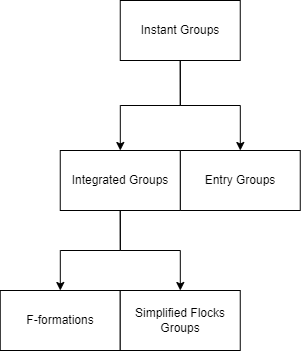

# Groups

## Summary
Project containing components for groups detections, the following diagram explain the hierarchy of components:  

## Files
* [Entry Groups Detector](src/EntryGroupsDetector.cs)
* [Entry Groups Detector Configuration](src/EntryGroupsDetectorConfiguration.cs)
* [Flock Group Intersection](src/FlockGroupIntersection.cs)
* [Instant Groups Detector](src/InstantGroupsDetector.cs)
* [Instant Groups Detector Configuration](src/InstantGroupsDetectorConfiguration.cs)
* [Integrated Groups Detector](src/IntegratedGroupsDetector.cs)
* [Integrated Groups Detector Configuration](src/IntegratedGroupsDetectorConfiguration.cs)
* [Simplified Flock Group](src/SimplifiedFlockGroup.cs)
* [Simplified Flock Groups Detector](src/SimplifiedFlockGroupsDetector.cs)
* [Simplified Flock Groups Detector Configuration](src/SimplifiedFlockGroupsDetectorConfiguration.cs)
* [Helpers](src/Helpers/Helpers.cs) contains methods of ids generation and groups simplifications.

## Curent issues

## Future works
