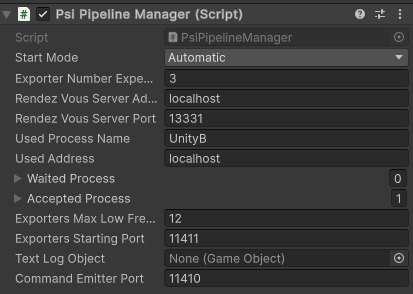

# Platform for Situated Intelligence in Android with Unity
Dlls from build will not work as it, some modifications are needed for get it work in Unity (might work with versions newer than 2022.1.23f). A part of solution comes from this issue:
https://github.com/microsoft/psi/issues/263

In order to have shortcut code generation (from Emit.Reflexion) for serialization to happen, the default serializer need to be accessible and modifiable. Even if only TcpSource and TcpWriter are used, due to a test of ImmutableTypes in RecyclingPool (RecyclingPool.cs:24). 
Android does not handle the use of **dynamic** type with generic, all methods using **dynamic** need to be modified to a generic type.

All thoses modifications can be found in https://github.com/SaacPSI/psi branch UnityAndroid.

The unitypackage has been made with a fork from the \\psi repository with the last commit from 24/06/2023, commit ID : d08fdd34f6957a92a6343d6e7978c2b8efc5f83a
It includes modifications of RemoteExorter to include multi clients streaming (see [RemoteExporterModification.md](../../RemoteExporterModification.md))

## Unity Package
The package contains dlls and scripts in 3 folders:
In **Base** folder:
* PsiExporter : base script to inherit from for exporter scripts.
* PsiImporter : base script to inherit from for importer scripts.
* PsiPiplineManager : required component for scripts to work, can synchronise with other \\psi piplines through a **RemoteClockImporter**.
* PsiSerializerReflexion : file with serializers for KnownSerializer.

In **Exporters** folder:
* PsiExporterPosition : example of exporter to send position of the gameobject.
* PsiExporterPositionOrientation : example of exporter to send position \& rotation of the gameobject.
* PsiExporterImage : exporter to send image of the camera.
* PsiExporterImageAsSteam : exporter to send image of the camera as bytes stream.
* PsiExporterMatrix4x4  : exporter to the localToWorld matrix of the gameobject.

In **Formats** folder:
* PsiFormatImage : (De)Serialization for image. 
* Basics formats can be found on in the PsiFormats project, the dll can be add inside Unity.
* Others formats can be found in projects under the folders Formats/Unity/ 

In **Importers** folder:
* PsiImportePosition : example of importer to set position of the gameobject.
* PsiImporterPing : example of importer to handle ping from server.

In Unity Microsoft.BCL.Async should be configured as :

 

## How it works
Add the PsiPiplineManager in a GameObject and configure it 

 

*Android version*

And add exporters \& importers, for new type of serialization, you need to add :
* A serializer in PsiAddedSerializer.
* This serializer, in the PsiPiplineManager :
    
        protected void InitializeSerializer(KnownSerializers serializers)
        {
            serializers.Register<bool, BoolSerializer>();
            serializers.Register<char, CharSerializer>();
            serializers.Register<System.Numerics.Vector3, Vector3Serializer>();
            serializers.Register<Tuple<System.Numerics.Vector3, System.Numerics.Vector3>, TupleOfVector3Serializer>();
        }

* A need PsiFormat of the type.
* Create the component(s) of using the base class PsiExporter/PsiImporter.
* Use your component(s)!
* On the server side you should use the same format classes :

        public class PsiFormatBoolean
        {
            public static Format<bool> GetFormat()
            {
                return new Format<bool>(WriteBoolean, ReadBoolean);
            }

            public static void WriteBoolean(bool boolean, BinaryWriter writer)
            {
                writer.Write(boolean);
            }

            public static bool ReadBoolean(BinaryReader reader)
            {
                return reader.ReadBoolean();
            }
        }

        public class PsiFormaChar
        {
            public static Format<char> GetFormat()
            {
                return new Format<char>(WriteChar, ReadChar);
            }

            public static void WriteChar(char character, BinaryWriter writer)
            {
                writer.Write(character);
            }

            public static char ReadChar(BinaryReader reader)
            {
                return reader.ReadChar();
            }
        }

        public class PsiFormatPositionAndOrientation
        {
            public static Format<Tuple<System.Numerics.Vector3, System.Numerics.Vector3>> GetFormat()
            {
                return new Format<Tuple<System.Numerics.Vector3, System.Numerics.Vector3>>(WritePositionOrientation, ReadPositionOrientation);
            }

            public static void WritePositionOrientation(Tuple<System.Numerics.Vector3, System.Numerics.Vector3> point3D, BinaryWriter writer)
            {
                writer.Write((double)point3D.Item1.X);
                writer.Write((double)point3D.Item1.Y);
                writer.Write((double)point3D.Item1.Z);
                writer.Write((double)point3D.Item2.X);
                writer.Write((double)point3D.Item2.Y);
                writer.Write((double)point3D.Item2.Z);
            }

            public static Tuple<System.Numerics.Vector3, System.Numerics.Vector3> ReadPositionOrientation(BinaryReader reader)
            {
                return new Tuple<System.Numerics.Vector3, System.Numerics.Vector3>(new System.Numerics.Vector3((float)reader.ReadDouble(), (float)reader.ReadDouble(), (float)reader.ReadDouble()),
                                new System.Numerics.Vector3((float)reader.ReadDouble(), (float)reader.ReadDouble(), (float)reader.ReadDouble()));
            }
        }

        class Program
        {
 
            static private void Connection<T>(string name, TcpSourceEndpoint? source, Pipeline p, Format<T> deserializer)
            {
                source?.ToTcpSource<T>(p, deserializer, null, true, name).Do((d, e) => { Console.WriteLine($"Recieve {name} data @{e} : {d}"); });
            }

            static void Main(string[] args)
            {
                var host = "192.168.1.159";
                Pipeline p = Pipeline.Create(enableDiagnostics: true);

                var remoteClock = new RemoteClockExporter(port: 11510);

                //Light
                Emitter<bool> lightEmitter = p.CreateEmitter<bool>(p,"lightEmitter");
                var timer = Timers.Timer(p, TimeSpan.FromSeconds(1));
                bool alternate = false;
                timer.Out.Do(t =>
                {
                    Console.WriteLine($"Send {alternate}");
                    lightEmitter.Post(alternate, p.GetCurrentTime());
                    alternate = !alternate;
                });
                TcpWriter<bool> tcpWiter = new TcpWriter<bool>(p, 11511, PsiFormatBoolean.GetFormat(), "Light");
                lightEmitter.PipeTo(tcpWiter);

                bool canStart = false;
                var process = new Rendezvous.Process("Server", new[] { remoteClock.ToRendezvousEndpoint(host), tcpWiter.ToRendezvousEndpoint<bool>(host, "Light") });
                var server = new RendezvousServer();
                server.Rendezvous.TryAddProcess(process);
                server.Rendezvous.ProcessAdded += (_, pr) =>
                {
                    Console.WriteLine($"Process {pr.Name}");
                    if (pr.Name == "Unity")
                    {
                        foreach (var endpoint in pr.Endpoints)
                        {
                            if (endpoint is Rendezvous.TcpSourceEndpoint)
                            {
                                TcpSourceEndpoint? source = endpoint as TcpSourceEndpoint;
                                foreach (var stream in endpoint.Streams)
                                {
                                    Console.WriteLine($"\tStream {stream.StreamName}");
                                    switch (stream.StreamName)
                                    {
                                        case "Left":
                                        case "Right":
                                        case "Player":
                                        case "Black":
                                        case "Yellow":
                                        case "Red":
                                        case "Purple":
                                        case "Green":
                                            Connection<Tuple<Vector3, Vector3>>(stream.StreamName, source, p, PsiFormatPositionAndOrientation.GetFormat());
                                            break;
                                        case "OutDigiCode":
                                            Connection<char>(stream.StreamName, source, p, PsiFormaChar.GetFormat());
                                            break;
                                        case "IsSuccess":
                                            Connection<bool>(stream.StreamName, source, p, PsiFormatBoolean.GetFormat());
                                            break;
                                    }
                                }
                            }
                        canStart = true;
                    }
                };
                server.Error += (s, e) => { Console.WriteLine(e.Message); Console.WriteLine(e.HResult); };
                server.Start();
                while (!canStart) Thread.Sleep(500);
                Thread.Sleep(500);
                //// RunAsync the pipeline in non-blocking mode.
                p.RunAsync();
                //// Wainting for an out key
                Console.WriteLine("Press any key to stop the application.");
                Console.ReadLine();
                //// Stop correctly the pipeline.
                p.Dispose();
                return;
            }
        }

