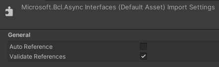

# Platform for Situated Intelligence in Unity
Dlls from build will not work as it, some modifications are needed for get it work in Unity (might work with versions newer than 2022.1.23f). The solution comes from this issue:
https://github.com/microsoft/psi/issues/263

In project **Microsoft.Psi** of the \\psi repository the file *Common\TypeResolutionHelper.cs* needs to be modified. Two switch have to be done in the method *GetVerifiedType(string typeName)* from 

    type = Type.GetType(typeName, AssemblyResolver, null);
    
to
    
    type = Type.GetType(typeName);

The unitypackage has been made with a fork from repository with the last commit from 24/06/2023, commit ID : d08fdd34f6957a92a6343d6e7978c2b8efc5f83a
It includes modifications of RemoteExorter to include multi clients streaming (see [RemoteExporterModification.md](../../RemoteExporterModification.md))

## Current limitation
At the moment, using \\psi imaging system is incompatible with Unity. This limitation as not been investigate as we use WebRTC.

## Unity Package
The package contains dlls and 5 scripts:
* PsiExporter : base script to inherit from for exporter scripts.
* PsiImporter : base script to inherit from for importer scripts.
* PsiPositionExporter : example of exporter to send position of the gameobject.
* PsiPositionImporter : example of importer to set position of the gameobject.
* PsiPiplineManager : required component for scripts to work, can synchronise with other \\psi piplines through a **RemoteClockImporter**.

In Unity dlls should be configured as :  

Special case for Microsoft.BCL :
 