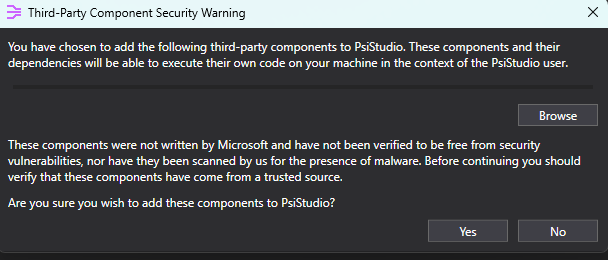
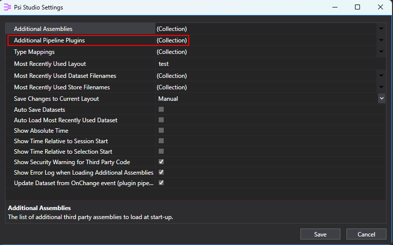
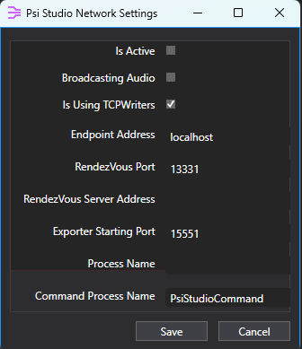
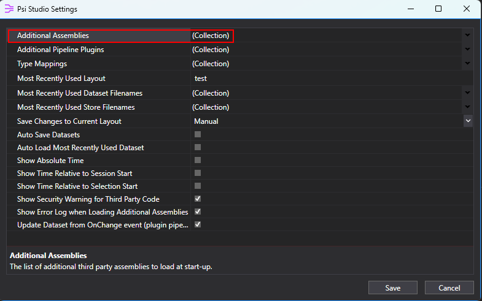
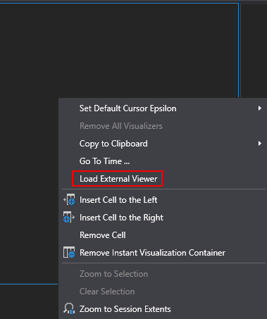
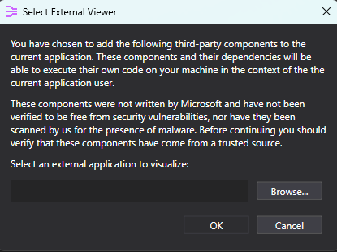

# PsiStudio Modifications Documentation

## Introduction

This document describes the architectural modifications made to the Microsoft.Psi.PsiStudio application and its dependencies. The modifications are organized into three main features: **PsiStudio Pipeline**, **PsiStudio Network**, and **External Viewer**. These enhancements enable PsiStudio to support pipeline plugin management, network streaming capabilities, and external viewer integration for advanced visualization workflows.
The three feature modifications provide PsiStudio with:

1. **Pipeline Plugin Support** - Execute custom data processing pipelines with integrated visualization
2. **Network Distribution** - Stream and visualize data from remote \Psi applications
3. **External Viewer Integration** - Leverage specialized external applications for domain-specific visualization

All features integrate seamlessly with existing PsiStudio components while maintaining backward compatibility and adhering to architectural principles.
All thoses modifications can be found in the [fork](https://github.com/SaacPSI/psi) on the PsiStudio branch.

---

## Part 1: PsiStudio Pipeline

### Overview

The PsiStudio Pipeline feature provides a framework for loading, managing, and executing pipeline plugins within PsiStudio. This allows users to run custom data processing pipelines directly within the visualization environment.

 

### Core Components

#### 1.1 IPsiStudioPipeline Interface
**File:** `Sources\Tools\PsiStudio\Microsoft.Psi.PsiStudio\PipelinePlugin\IPsiStudioPipeline.cs`

This interface defines the contract that all pipeline plugins must implement:

```
Interface: IPsiStudioPipeline
├── GetReplayableMode(): PipelineReplaybleMode
├── RunPipeline(TimeInterval): bool
├── StopPipeline(): void
├── GetDataset(): Dataset
├── GetStartTime(): DateTime
├── IsRunning: bool
├── Name: string
├── OnDatasetLoaded(Action<Dataset>): void
├── GetLayout(): string
├── GetAnnotation(): string
├── ShowWindow(): void
├── CloseWindow(): void
└── Dispose(): void
```

**Key Responsibilities:**
- Define replay mode (indicating whether the pipeline can be replayed in PsiStudio)
- Manage pipeline execution lifecycle
- Provide dataset and timing information
- Supply layout and annotation schemas
- Handle UI interactions

#### 1.2 PsiStudioPipelineAssemblyHandler
**File:** `Sources\Tools\PsiStudio\Microsoft.Psi.PsiStudio\PipelinePlugin\PsiStudioPipelineAssemblyHandler.cs`

This class  acts as a bridge between PsiStudio and loaded pipeline assemblies:

**Key Responsibilities:**
- Load pipeline assemblies dynamically
- Instantiate pipeline components that implement IPsiStudioPipeline
- Manage the pipeline lifecycle (start, stop, dispose)
- Provide access to pipeline data (dataset, layouts, annotations)
- Expose pipeline state (running, name, etc.)

**Architecture:**
```
PsiStudioPipelineAssemblyHandler
├── Assembly Loading & Reflection
├── Component Discovery
├── Lifecycle Management
│   ├── Start()
│   ├── Stop()
│   └── Dispose()
└── Data Access
    ├── GetDataset()
    ├── GetLayout()
    └── GetAnnotation()
```

#### 1.3 PiplinePluginsWindow
**File:** `Sources\Tools\PsiStudio\Microsoft.Psi.PsiStudio\PipelinePlugin\PiplinePluginsWindow.xaml.cs`

This WPF window provides the user interface for selecting and loading pipeline plugins:

**Features:**
- Browse and select available pipeline plugins
- Display plugin metadata
- Load selected plugin assembly
- Provide feedback on loading status

**Integration Points:**
- MainWindowViewModel for plugin lifecycle management
- PluginMap for discovering available plugins
- Settings storage for selected plugins

 

### Integration with MainWindowViewModel

#### 1.4 Modifications to MainWindowViewModel.cs

The MainWindowViewModel has been extended to manage pipeline plugin lifecycle:

**New Private Fields:**
```csharp
private PipelinePlugin.PsiStudioPipelineAssemblyHandler psiStudioPipelinePluginInstance = null;
```

**New Public Properties:**
```csharp
public bool ShowUpdateDatasetButton 
    => this.psiStudioPipelinePluginInstance != null 
       && !this.Settings.AutoRefreshDatasetOnChangeFromPlugin;

public bool IsPlaying 
    => (this.psiStudioPipelinePluginInstance != null 
        && this.psiStudioPipelinePluginInstance.IsRunning) 
    || this.VisualizationContainer.Navigator.IsCursorModePlayback;
```

**Key Methods:**
- `PlayPauseFromSelectionStartCommand`: Enhanced to support running pipeline plugins
- `PipelinePluginsWindow()`: Opens the plugin selection dialog
- `EditPipelinePluginSettings()`: Shows plugin configuration UI
- `OpenDataset(Dataset)`: Called when pipeline provides new data

**Plugin Lifecycle Management:**
```
User Selects Plugin
    ↓
[PiplinePluginsWindow loads assembly]
    ↓
[PsiStudioPipelineAssemblyHandler instantiated]
    ↓
[Plugin implements IPsiStudioPipeline]
    ↓
[Plugin state available in MainWindowViewModel]
```

 

### Integration with PsiStudioSettings

#### 1.5 Modifications to PsiStudioSettings.cs

The settings class has been extended to persist pipeline plugin preferences:

**New Collections:**
```csharp
public List<string> AdditionalPlugins { get; set; } = new ();
```

**Serialization Support:**
```xml
<AdditionalPlugins>
    <Plugins>[plugin assembly path]</Plugins>
</AdditionalPlugins>
```

### Integration with PsiStudioSettingsViewModel

#### 1.6 Modifications to PsiStudioSettingsViewModel.cs

The settings view model provides UI binding for plugin management:

**New Property:**
```csharp
[PropertyOrder(1)]
[DisplayName("Additional Pipeline Plugins")]
[Description("The list of additional third party pipeline assemblies.")]
public List<string> AdditionalPipelineAssembliesAsStringList { get; set; }
```

**Update Logic:**
- Detects changes to pipeline plugins list
- Triggers application restart requirement if plugins change

### Data Flow Diagram

```
┌─────────────────────────────────────────────────────────────┐
│                   PsiStudio Application                     │
├─────────────────────────────────────────────────────────────┤
│                                                             │
│  [MainWindowViewModel]                                      │
│        │                                                    │
│        ├─→ [PsiStudioPipelineAssemblyHandler]               │
│        │        │                                           │
│        │        └─→ [Loaded Pipeline Assembly]              │
│        │             (implements IPsiStudioPipeline)        │
│        │                                                    │
│        ├─→ [PsiStudioSettings]                              │
│        │   (stores plugin paths)                            │
│        │                                                    │
│        └─→ [VisualizationContainer]                         │
│            (renders pipeline output)                        │
│                                                             │
└─────────────────────────────────────────────────────────────┘
```

---

## Part 2: PsiStudio Network

### Overview

The PsiStudio Network feature enables streaming of data from remote \Psi Stores over TCP/IP networks. This allows distributed data collection, processing, and visualization across multiple machines.
It does not provide any pipeline execution capabilities but only the network streaming.

### Core Components

#### 2.1 Network Architecture

**Directory:** `Sources\Tools\PsiStudio\Microsoft.Psi.PsiStudio\Network\`

The network subsystem consists of the following key components:

```
Network Subsystem
├── NetworkStreamsManager
├── PsiStudioNetworkSettings
├── NetworkConfigurationWindow
├── PsiStudioNetworkInfo
├── PsiFormatPsiStudioNetworkInfo
├── PsiFormatAudioBuffer
├── NetworkedStreamValueVisualisationObject<TData>
└── IActivableStreamVisualizationObject
```

#### 2.2 NetworkStreamsManager
**File:** `Sources\Tools\PsiStudio\Microsoft.Psi.PsiStudio\Network\NetworkStreamsManager.cs`

Central manager for network streaming operations:

**Key Responsibilities:**
- Establish connections to remote \Psi streams
- Manage active network stream sources
- Handle network errors and disconnections
- Coordinate with visualization objects

**Class Structure:**
```csharp
public class NetworkStreamsManager
{
    public PsiStudioNetworkSettings Settings { get; private set; }
    public Navigator Navigator { get; private set; }
    
    public void UpdateSettings(PsiStudioNetworkSettings settings);
    public void Dispose();
}
```

#### 2.3 PsiStudioNetworkSettings
**File:** `Sources\Tools\PsiStudio\Microsoft.Psi.PsiStudio\Network\PsiStudioNetworkSettings.cs`

Configuration container for network parameters:

**Properties:**
```csharp
public class PsiStudioNetworkSettings
{
    public string ServerAddress { get; set; }
    public int ServerPort { get; set; }
    public List<string> AvailableStreams { get; set; }
    public List<string> SelectedStreams { get; set; }
    // ... additional configuration
}
```

 

#### 2.4 NetworkConfigurationWindow
**File:** `Sources\Tools\PsiStudio\Microsoft.Psi.PsiStudio\Network\NetworkConfigurationWindow.xaml.cs`

WPF window for network configuration:

**Features:**
- Configure server address and port
- Discover available remote streams
- Select streams to visualize
- Display connection status

**UI Elements:**


#### 2.5 PsiStudioNetworkInfo
**File:** `Sources\Tools\PsiStudio\Microsoft.Psi.PsiStudio\Network\PsiStudioNetworkInfo.cs`

Data structure representing network-streamed information:

```csharp
public class PsiStudioNetworkInfo
{
    public PsiStudioNetworkEvent Event { get; private set; }
    public string SessionName { get; private set; }
    public TimeInterval Interval { get; private set; }
    public double PlaySpeed { get; private set; };
}
```

#### 2.6 NetworkedStreamValueVisualisationObject<TData>
**File:** `Sources\Tools\PsiStudio\Microsoft.Psi.PsiStudio\Network\NetworkedStreamValueVisualisationObject{TData}.cs`

Generic visualization object for network streams:

**Generic Parameter:**
- `TData`: The data type of the network stream

**Responsibilities:**
- Receive network stream data
- Update visualization based on received data
- Handle type-specific rendering logic

### Integration with MainWindowViewModel

#### 2.7 Modifications to MainWindowViewModel.cs

Network management is integrated into the main view model:

**New Private Fields:**
```csharp
private NetworkStreamsManager networkManager = null;
```

**New Commands:**
```csharp
public RelayCommand NetworkConfigurationCommand
    => this.networkConfigurationCommand ??= 
        new RelayCommand(() => this.NetworkSettingsWindow());
```

**Key Methods:**
```csharp
private void NetworkSettingsWindow()
{
    // Create/update NetworkStreamsManager
    // Show NetworkConfigurationWindow
    // Handle connection lifecycle
}

private void OpenDataset(Dataset dataset)
{
    // Determine if network should be active
    // Load dataset accordingly
}
```

**Conflict Resolution Logic:**
- Pipeline plugins and network manager cannot run simultaneously
- User is prompted to choose which system to use
- Proper cleanup of inactive system

### Data Flow Diagram

```
┌─────────────────────────────────────────────────────────┐
│              Remote Psi Pipeline                        │
│            (on different machine)                       │
└────────────────────────┬────────────────────────────────┘
                         │
                    [TCP/IP Stream]
                         │
        ┌────────────────▼────────────────┐
        │    Network Interface            │
        │  [NetworkStreamsManager]        │
        └────────────────┬────────────────┘
                         │
        ┌────────────────▼────────────────┐
        │   [Navigator] synchronization   │
        └────────────────┬────────────────┘
                         │
        ┌────────────────▼────────────────────────┐
        │  NetworkedStreamValueVisualisationObject│
        │            <TData>                      │   
        └────────────────┬────────────────────────┘
                         │
        ┌────────────────▼─────────────┐
        │   Visualization Panel        │
        │   (displays network data)    │
        └──────────────────────────────┘
```

### Stream Type Support

The network subsystem supports any stream types through loading assemblies containings classes for serializing and deserializing with three methods `GetFormat`, `Write` & `Read`. Thoses (de)serializing are loaded throught the Addional Assemblies mechanism. 
The exception for stream types is Audio stream that are managed throught the pipeline insode the navigator to make sure that the audio is correct (see Navigator.cs:902).

 

---

## Part 3: External Viewer

### Overview

The External Viewer feature enables visualization of streams using external applications or specialized visualization components. This provides flexibility for domain-specific visualization requirements that exceed built-in capabilities.

### Core Components

#### 3.1 ExternalApplicationVisualizationPanel
**File:** `Sources\Visualization\Microsoft.Psi.Visualization.Windows\VisualizationPanels\ExternalApplicationVisualizationPanel.cs`

A specialized visualization panel that hosts external viewers:

**Key Responsibilities:**
- Manage external application lifecycle
- Communicate with external viewer process
- Handle data transfer to external application
- Bridge \Psi visualization framework with external tools

**Class Structure:**
```csharp
public class ExternalApplicationVisualizationPanel : VisualizationPanel
{
    public string ExternalViewerPath { get; set; }
    public Process ExternalViewerProcess { get; private set; }
    
    public void StartExternalViewer(string viewerPath);
    public void SendDataToExternalViewer(object data);
    public void StopExternalViewer();
    protected override DataTemplate CreateDefaultViewTemplate();
}
```

#### 3.2 ExternalApplicationPanelView
**File:** `Sources\Visualization\Microsoft.Psi.Visualization.Windows\Views\ExternalApplicationPanelView.xaml.cs`

WPF view for the external viewer panel:

**Features:**
- Display external application window
- Handle resize events
- Manage process UI integration
- Show connection status

**XAML Structure:**
```xml
<Grid>
    <StackPanel Orientation="Vertical">
        <TextBlock Text="External Viewer: {Binding ExternalViewerPath}" />
        <Border Name="ExternalViewerHost" />
        <StatusBar>
            <TextBlock Text="{Binding ConnectionStatus}" />
        </StatusBar>
    </StackPanel>
</Grid>
```

#### 3.3 Modification of InstantVisualizationPlaceholderPanel
**File:** `Sources\Visualization\Microsoft.Psi.Visualization.Windows\VisualizationPanels\InstantVisualizationPlaceholderPanel.cs`

A placeholder panel in instant visualization containers, adding a context menu item to load the external viewer:

**Key Code:**
```csharp
 var contextMenuItems = base.ContextMenuItemsInfo();
            contextMenuItems.Add(
               new ContextMenuItemInfo(
                   null,
                   $"Load External Viewer",
                   VisualizationContext.Instance.LoadExternalViewer,
                   isEnabled: true,
                   commandParameter: this));
```

 

#### 3.4 VisualizationContext Extensions
**File:** `Sources\Visualization\Microsoft.Psi.Visualization.Windows\VisualizationContext.cs`

The VisualizationContext has been extended to support external viewers:

**New Methods:**
```csharp
public class VisualizationContext
{
    // Command to load external viewer
    public RelayCommand<object> LoadExternalViewer;
    // Load external viewer
    public void OnLoadExternalViewer(object parameter);

}
```

### Integration with MainWindowViewModel

#### 3.5 Modifications to MainWindowViewModel.cs

The main view model has been extended for external viewer support:

**Selection Window Integration:**
```csharp
private void OnLoadExternalViewer(object sender, EventArgs e)
{
    var selectViewerWindow = new SelectExternalViewerWindow(
        Application.Current.MainWindow);
    
    if (selectViewerWindow.ShowDialog() == true)
    {
        var viewerPath = selectViewerWindow.SelectedViewerPath;
        // Load external viewer
    }
}
```

### SelectExternalViewerWindow

**File:** `Sources\Visualization\Microsoft.Psi.Visualization.Windows\Windows\SelectExternalViewerWindow.xaml.cs`

Dialog for selecting external viewer applications:

**Features:**
- Browse file system for executable files
- Display available viewer options
- Show viewer metadata (description, supported types)
- Confirm selection

**UI Layout:**
 

### Data Flow for External Viewer

```
┌─────────────────────────────────────────────────┐
│         Stream Data from Psi Pipeline           │
└────────────────────┬────────────────────────────┘
                     │
        ┌────────────▼──────────────┐
        │ Visualization Container   │
        │ (grid-based layout)       │
        └────────────┬──────────────┘
                     │
        ┌────────────▼──────────────────────────┐
        │ InstantVisualizationPlaceholderPanel  │
        │ (user selects "Load External Viewer") │
        └────────────┬──────────────────────────┘
                     │
        ┌────────────▼──────────────────────────┐
        │ SelectExternalViewerWindow            │
        │ (user chooses viewer application)     │
        └────────────┬──────────────────────────┘
                     │
        ┌────────────▼──────────────────────────┐
        │ ExternalApplicationVisualizationPanel │
        │ (launches external process)           │
        └────────────┬──────────────────────────┘
                     │
        ┌────────────▼──────────────────────────┐
        │ ExternalApplicationPanelView          │
        │ (integrates process window)           │
        └────────────┬──────────────────────────┘
                     │
        ┌────────────▼──────────────────────────┐
        │ External Viewer Process               │
        │ (receives data via IPC)               │
        └───────────────────────────────────────┘
```

### Stream Compatibility

External viewers can be associated with specific stream types:

**Metadata Structure:**
```json
 {
            "$id": "0",
            "$type": "Microsoft.Psi.Visualization.VisualizationPanels.ExternalApplicationVisualizationPanel, Microsoft.Psi.Visualization.Windows",
            "VisualizationObjects": [],
            "Visible": true,
            "ApplicationPath": "C:\\Program Files (x86)\\Notepad++\\notepad++.exe",
            "EnableWindowSizing": true,
            "ClipToViewport": true,
            "CompatiblePanelTypes": [
              3,
              2,
              1
            ],
            "DefaultCursorEpsilonNegMs": 500,
            "DefaultCursorEpsilonPosMs": 0,
            "RelativeWidth": 100,
            "Name": "External Application - notepad++",
            "Height": 400.0,
            "BackgroundColor": "#FF252526"
          }
```

### Concurrency & Thread Safety

All components handle concurrent operations safely:

- **Pipeline Plugin**: Executes on dedicated worker thread
- **Network Streams**: Non-blocking async operations
- **External Viewer**: Process communication on child application

### Settings Persistence

All user preferences are persisted in `PsiStudioSettings`:

```
PsiStudioSettings
├── Pipeline Plugins
│   └── AdditionalPlugins (List<string>)
├── Network Configuration
│   └── LastNetworkSettings (PsiStudioNetworkSettings)
└── External Viewers
    └── LastExternalViewerPath (string)
```